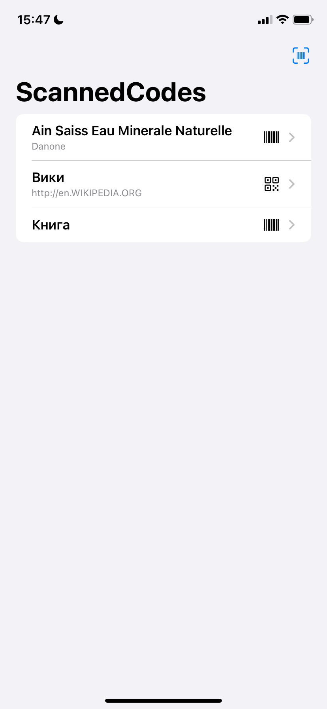
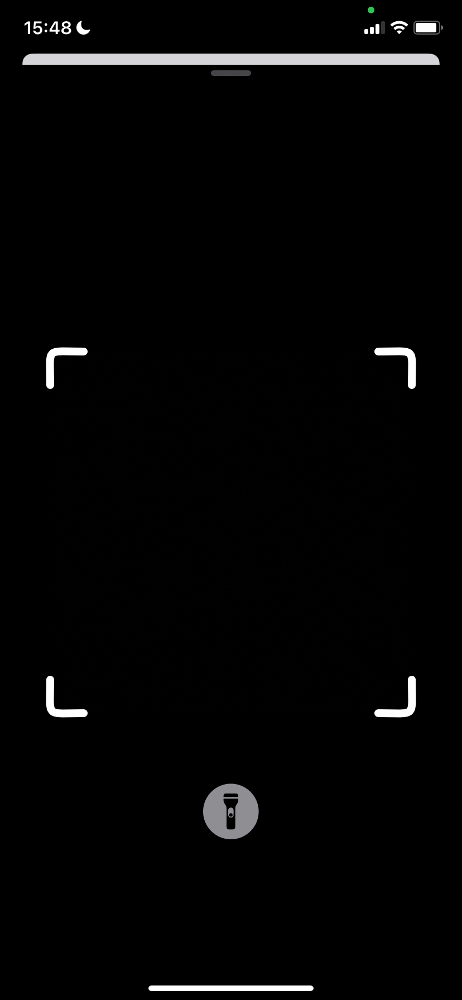
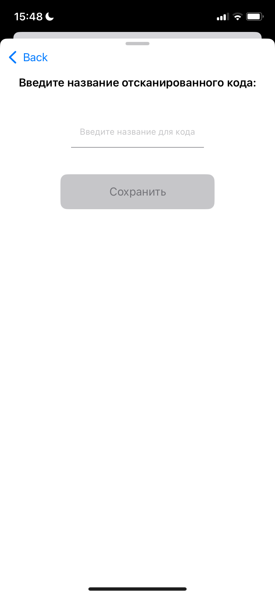
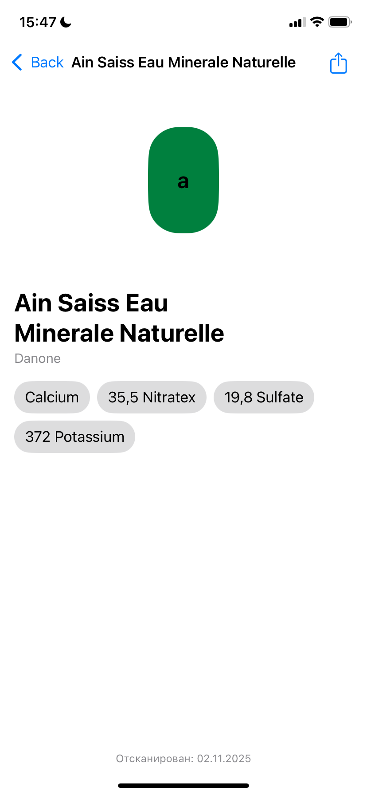
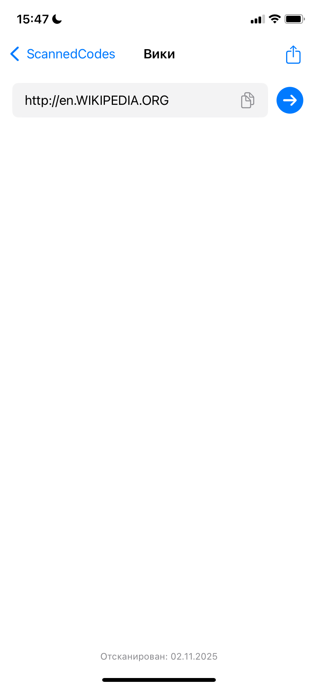

# Barcode (and QRcode) scanner

### **Описание 📝**
Приложение для сканирования, сохранения и просмотра баркодов и qr-кодов.

### **Превью 📷**
 
  

### **Функционал 📱**
* Сканирование, сохранение, просмотр и удаление баркодов и qr-кодов
* Получение и просмотр информации о продукте через API Open Food Facts
* Просмотр содержимого qr-кода
* Локальное сохрание кодов при помощи CoreData
* Предотвращение повторого сохранения уже отсканированного кода
* Возможность использования фонарика
* Возможность поделиться отсканированной информацией

### **Используемые технологии 🤹**
* Swift + SwiftUI
* MVVM
* Combine
* CoreData
* AVFondation
* URLSession

### **Дополнительная информация 👨‍💻**
* Реализована динамическая рамка для сканирования, изменяющая свои размеры под сканируемый код
* Отслеживание разрешения на камеру (при отсутствии разрешения показывается алерт)
* Обработка всех ошибок с отображением алертов
* Предусмотрен вариант сканирования всевозможных баркодов и отображения тех, информации о которых нет на сервере
* Есть возможность изменить название для сохраняемого кода
* Поддержка темной темы
